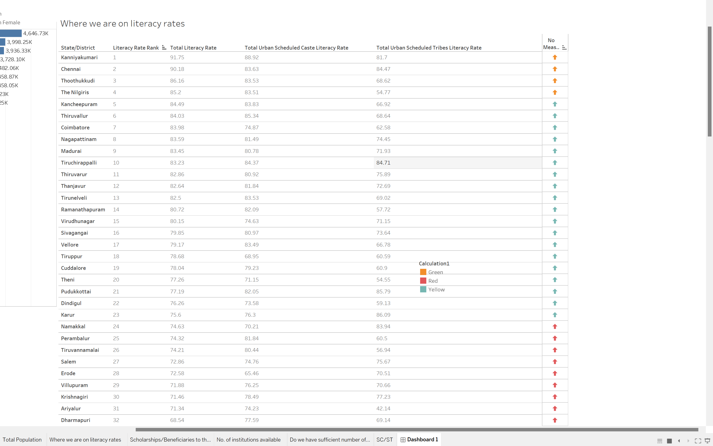

# GenderBiasinScienceandTechnicalfield

## Introduction
This dashboard empowers mission driven organizations to harness the power of data visualization for social change. The data set talks about the literacy rates in Tamilnadu. It is distributed according to the cities and their ranks. It contains the population, as per the gender.
This dashboard gives us the insight about the female population when compared to the total, and it addresses the question of where the state is on literacy wise. It shows us the status of each city and it also shows the scholarship/Beneficiaries each state is getting. The data has different institutions available and the number of teachers available.

## Features
1. Demographic Analysis
The Demographic Analysis dashboard provides insights into the gender distribution across different levels of education, employment sectors, and professional roles within the science and technical fields in Tamil Nadu.

2. Education and Training
The Education and Training dashboard examines the enrollment rates, academic performance, and access to educational resources for women pursuing science and technical education in Tamil Nadu.

3. Employment and Workforce Participation
The Employment and Workforce Participation dashboard analyzes the representation of women in various technical roles, leadership positions, and industries within Tamil Nadu, highlighting areas of underrepresentation and bias.

4. Gender Bias Assessment
The Gender Bias Assessment dashboard assesses implicit and explicit biases faced by women in science and technical fields through survey data, interviews, and case studies, aiming to raise awareness and promote organizational change.

## Analysis
1. First, I created the Stacked Bar Chart of total population and among them total population female who are given education for Tamil Nadu state city wise to analyse the gender bias concept in that state.
2. In second worksheet, in the table form i mentioned the literacy rank with total literacy rate and what are the rates in urban areas for schedule caste and  schedule tribes. In this worksheet by the use of KPIs by parameter and calculations we can see that which cities have good, medium or poor literacy rates.
3. In third worksheet, I created bar cum line chart to analyze total scholarships and beneficiaries program performed for increasing literacy rates in different cities in Tamil Nadu.
4. In 4th worksheet, i created a bar chart to see total no. of institutions in these cities.
5. And in the last worksheet do analyze if we have enough number of teachers i created a side by side chart to see total no. of teavhers and among them how many are female in different types of  high schools.
6. Then at the last,  Icreated an interactive dashboard to see all the information in the form of article to analyze the literacy rate in Tamil Nadu.

## Contact Information
For inquiries or support regarding this project, please contact Arsh Zehra at zehrarsh@gmail.com.
